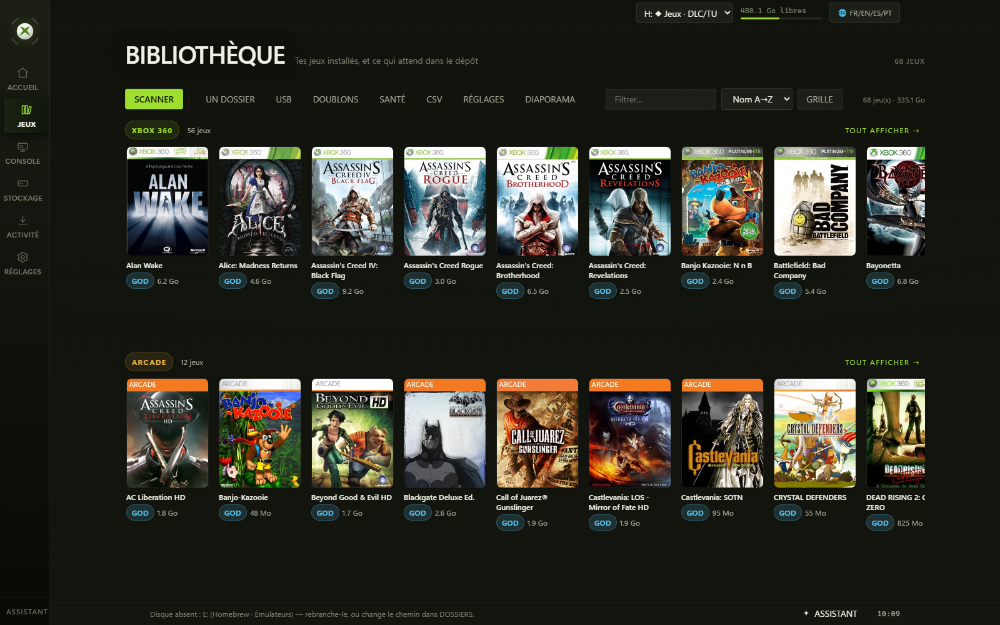
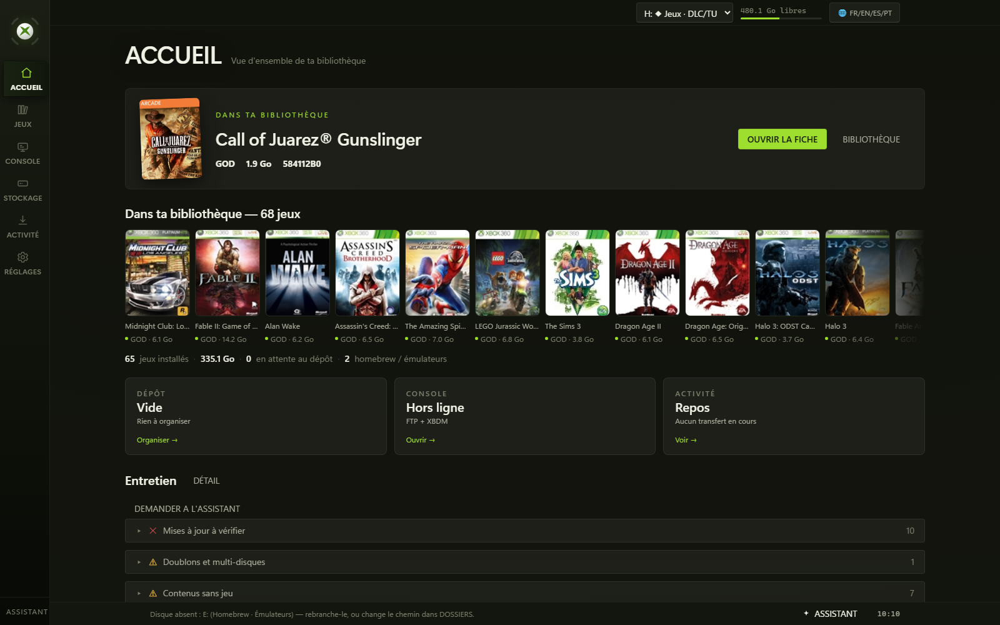
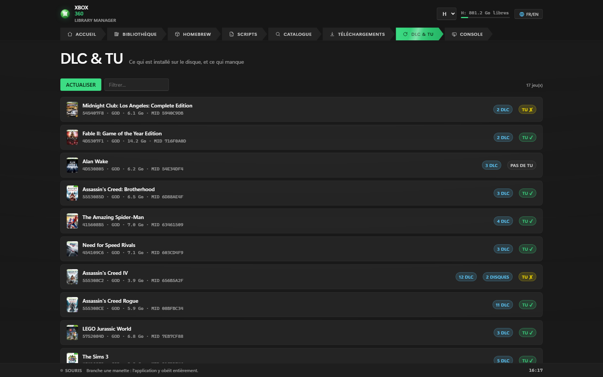
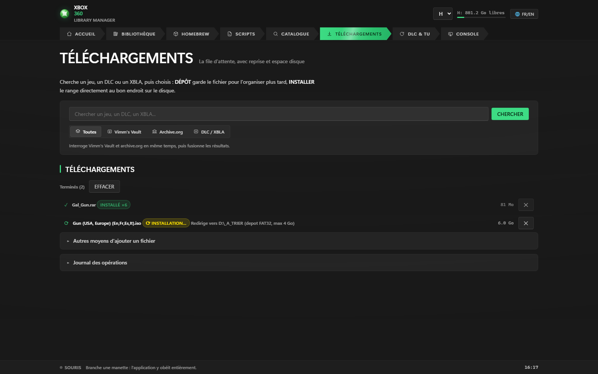
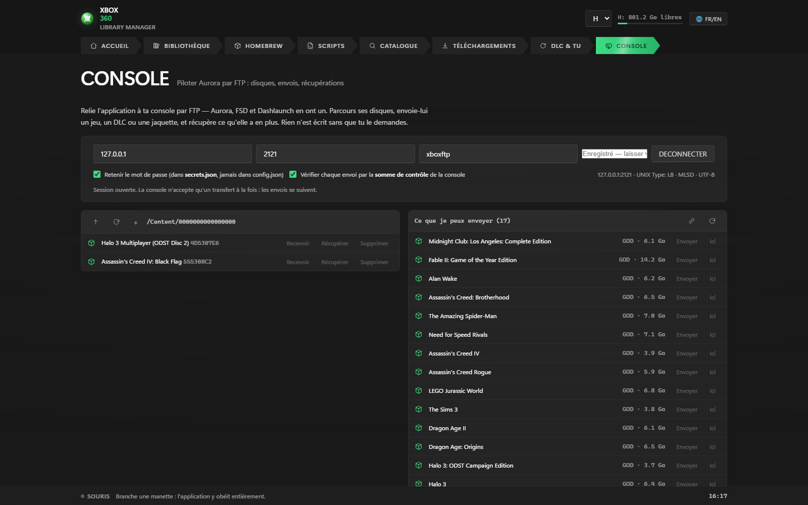
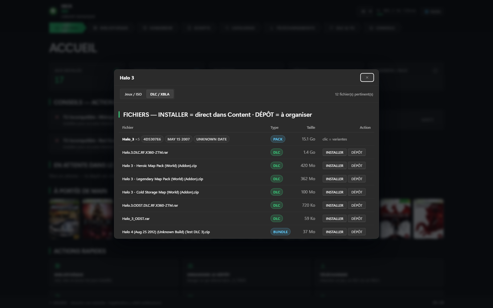
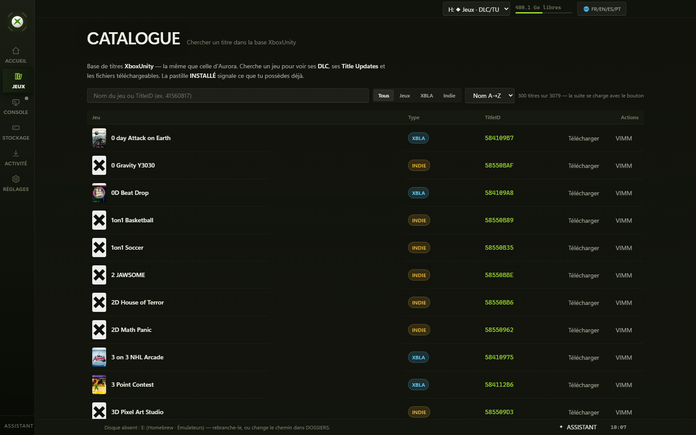
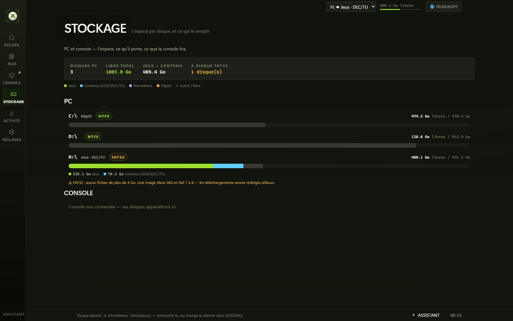
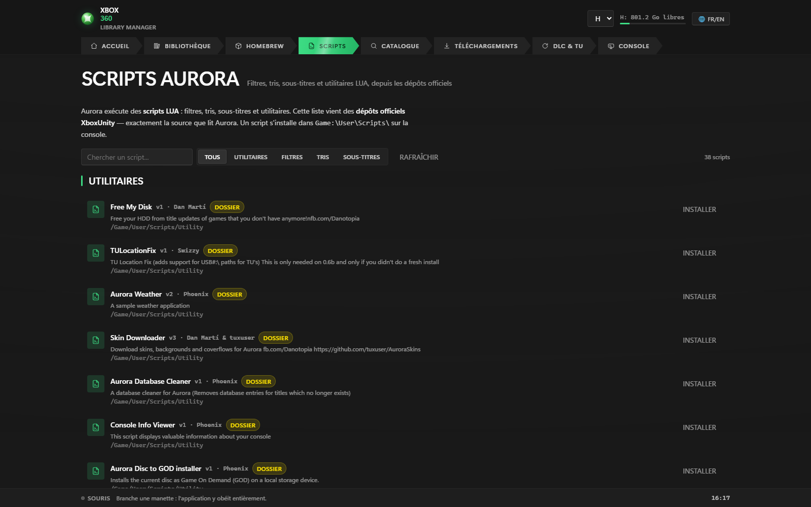
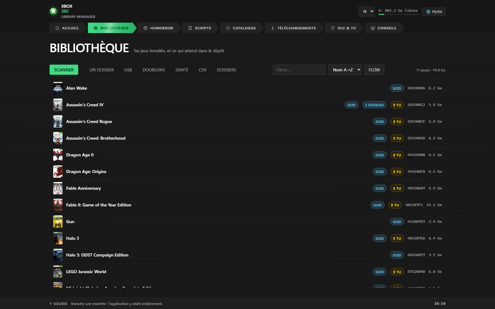

<div align="center">

# Xbox 360 Manager

**The PC companion Aurora never had** — an Xbox 360 library manager.

[](https://nodejs.org)
[](https://www.microsoft.com/windows)
[](LICENSE)
[](package.json)
[](../../actions/workflows/ci.yml)



</div>

---

## Why this exists

Copying a game dump onto an RGH/JTAG console by hand is a guessing game. You drop a folder into `Content`, Aurora shows nothing, and you move it again. You install the newest Title Update you can find, the game ignores it, and the DLC stops appearing — with no error message anywhere to explain why.

Two details cause most of that:

- **The console only reads DLC and Title Updates from `Content\<TID>\<type>`.** A game stored in the wrong tree simply does not exist as far as the dashboard is concerned.
- **A Title Update is only active for the MediaID of the disc it was installed for.** Every TU carries a MediaID; the disc's MediaID lives in its XEX. Install a TU that matches a different disc and the game skips it, which is a common cause of "my DLC stopped working".

This tool reads the TitleID and content type from the package headers, reads the MediaID from the XEX, and puts every file where the console actually looks. It manages a library you already have; deciding what belongs in it stays your call.

## What it looks like

The shelf above is the library view: an Aurora-style coverflow, with the selected
game's badges (format, TitleID, size, discs, available updates) and a title
watermark behind it.

**Home** — the state of your setup, and what is worth doing about it. Advices are actionable: a TU installed for the wrong disc, a leftover whose game is already installed, a cover that never downloaded.



**DLC & TU** — every installed game, its disc MediaID, how many DLC it has, and whether its Title Update actually applies. A red `TU ✗` is a TU installed for another disc: the console ignores it, and the DLC stays locked. This is the single screen that shows why the whole thing exists.



**Downloads** — a real queue with pause/resume, free-space checks, and per-source rules.



**Console** — drive Aurora over FTP. Two panes: the console on one side, what your PC can send on the other.



**DLC & updates** — searches archive.org and Vimm's Vault for a game's add-ons, scores them by whole word, and hides what does not belong to *that* game.



**Catalogue** — the XboxUnity title database, the same one Aurora reads.



**Storage** — per-drive space measured for real, segmented by what fills it: games, console content, homebrew, the drop folder. FAT32 drives are flagged — the console reads them, but no file over 4 GB fits, so downloads are redirected before they fail. When a console is connected over XBDM, its own volumes are measured the same way.



**Aurora scripts** — LUA filters, sorts, subtitles and utilities from the official XboxUnity repositories, installed straight to the console.



**List view** — the same library, dense, for when you are looking for one title.



## Features

| What you want to do | What the tool does |
|---|---|
| **See what you own** | Scans **GOD** packages, **XBLA** titles (`00080000` / `000D0000`) and extracted games (`default.xex`), plus anything waiting in the drop folder. TitleID is read from the package header (`0x360`), covers are fetched automatically (Xbox marketplace, then XboxUnity, then Xbox Live). Titles sharing a TitleID are flagged as duplicates — unless they are the two discs of a multi-disc game, which are recognised as such. |
| **Plug in a drive and be done** | Watches the drive letters every four seconds (0.2 ms per pass). A new drive is opened and classified by **what it contains**, not by its label: an Aurora/Content/`_A_TRIER` drive is added to the library and its games, homebrew and emulators appear on their own. Unplugging removes them again. Nothing is written to `config.json` — a hot-plugged drive is an additive, reversible runtime addition. |
| **Put files where the console reads them** | Routing by content type (`0x344`): GOD and XBLA go to `Games\<TID>\<type>`; DLC, Title Updates, saves and avatar items go to `Content\<TID>\<type>`. Each dropped file is analyzed first — type, TitleID, title, destination shown on screen — and **nothing moves without an explicit confirmation**. |
| **Make DLC and updates work** | Reads the disc **MediaID** from the XEX (`securityInfo` → `XSI+0x14C`), including inside a GOD's `.data` files, scanned in 8 MB blocks. Only Title Updates matching *your* disc are offered, and a TU installed for another MediaID is reported for what it is — a TU the console ignores, with DLC blocked as a result. |
| **Find the right DLC, not the noise** | Relevance is measured, not guessed. `<Other Game> - <Pack>` names belong to the game in the prefix (`Dante's Inferno - Isaac Clarke Dead Space Rig Costume` is not Dead Space DLC), and a one-word search must *open* the name — so `Gun` no longer returns `Gal Gun`, `Top Gun` and `Rock Band - The Gun Show`. Measured on 9 162 real collection names; when nothing fits, it says so instead of filling the screen. |
| **Drive the console over FTP** | Connects to Aurora, FSD or Dashlaunch. Browse its drives, send a whole game folder (recursive, with folders created as it goes), fetch files back, rename, delete, create folders, and compare the console's library with yours. **Every upload is verified with the console's own CRC32** — the `226` reply only means the server finished writing, not that the bytes are right. |
| **Install Aurora scripts** | Reads the four official XboxUnity repositories (38 LUA filters, sorts, subtitles and utilities) and installs them where Aurora expects them (`Game:\User\Scripts\...`), pushing them to the console over FTP when one is connected. |
| **Convert and unpack** | ISO → GOD (iso2god) with the **destination drive chosen per item**, ISO extraction (exiso), archive extraction (7-Zip), including archives nested inside archives. Conversion is media-aware, measured on real hardware: an SSD destination converts in place with all cores and finishes with a rename, a mechanical one converts on fast storage first and is then copied sequentially — the wrong choice was measured at 4× slower. A `.iso` that is really a 7z renamed by the host is detected by its magic bytes, not its extension. |
| **Install homebrew and emulators** | Curated catalogue of RGH/JTAG essentials — XeXMenu, Aurora, Dashlaunch, FSD, Simple 360 NAND Flasher, XM360, Xell, RetroArch, Mupen64-360, Snes360, Genesis Plus — with automatic installation into the homebrew or emulators folder. |
| **Find content across sources** | Searches archive.org and Vimm's Vault, scores results **by whole word** against the title, and ranks TitleID matches highest. Soundtracks, press kits, trailers and generic multi-game packs are pushed down or filtered out; matches with no score are hidden behind *show all*. |
| **Download with a real queue** | Persistent queue (`downloads.json`), up to 3 parallel downloads, pause/resume through HTTP `Range`, reordering, and a free-space check before writing (a full FAT32 volume redirects the file to an NTFS/exFAT drop drive instead of failing). |
| **Keep the library clean** | Advisor pass over the library: orphan content, duplicates, pending drop items, **leftovers whose game is already installed** (a 6 GB ISO that never got deleted after installing, with the space it reclaims), missing covers, missing or incompatible Title Updates, and failed downloads with a suggested alternative source. |
| **Audit DashLaunch** | Reads `launch.ini` and reports what would go wrong at boot: a path with an unknown device prefix, a port out of range, a key that appears twice (DashLaunch keeps the first and silently ignores the second), `fakelive` overriding `liveblock`, `autofake` with no TitleID, `livestrong` breaking Aurora's covers. Comments, ordering and unknown keys are preserved byte for byte. |
| **Use it from the couch** | A connected controller drives the whole interface: D-pad and stick move the focus, A activates, B goes back, LB/RB change section, START returns home. The focus ring is enlarged under controller input, because the Fluent one is invisible from three metres away. |
| **Check the machine, not the docs** | `npm run doctor` reports Node.js, title database, every optional external tool and every configured folder, separating what blocks startup from what only degrades a feature. |
| **Use it from your phone** | The same interface, served to LAN devices, with 44 px touch targets, card-layout tables and a pairing code — the network sees the app, the app asks the code. |

## Getting started

```bash
git clone https://github.com/shinzarou-eng/xbox360-manager.git
cd xbox360-manager
npm run doctor     # run this first: it says exactly what is missing
npm start          # then open http://localhost:4360
```

No `npm install` — the project has no dependencies.

**Prefer a real window?** `desktop/` builds a Windows shell (WPF + WebView2) that
hosts this same interface and **finds or starts** the server itself:

```powershell
dotnet build desktop\XboxManager.sln -m:1 -nr:false
powershell -ExecutionPolicy Bypass -File desktop\Installer.ps1   # Start-menu shortcut
```

Nothing is copied: the shortcut points at the executable where it is built, so your
data (`config.json`, `secrets.json`, `covers\`, `dl\`) stays next to the code. Node
must be installed. See `desktop/README.md`.

`npm run doctor` is the first command on purpose. A missing external tool or an unplugged drive produces a vague failure later; the doctor turns them into an explicit list, and tells you whether each one blocks startup or only disables a feature.

Open **http://localhost:4360**, go to the **FOLDERS** tab and set your paths. The app scans the configured drop folder and library folders from there.

### Optional external tools

These are freeware utilities, not bundled. Drop them at the paths below; without them the app still starts, only the matching actions disappear.

| Tool | Expected path | Used for |
|---|---|---|
| `7z` (7-Zip) | on `PATH` or `C:\Program Files\7-Zip\7z.exe` | Extracting zip / 7z / rar from the drop folder and from downloads |
| `iso2god.exe` | `iso2god.exe` | ISO → GOD conversion |
| `exiso.exe` | `exiso\exiso.exe` | Extracting an ISO into a game folder |
| `xextool.exe` | `ISO2GOD\xextool.exe` | Reading the TitleID of an extracted game's `.xex` |

`npm run doctor` locates each one and reports it as found, missing, or degraded.

## The console (FTP)

Aurora, FSD and Dashlaunch each run an FTP server. Set the address in the **CONSOLE** tab (default user and password: `xboxftp`), or read the password in Aurora under *Settings → FTP server*.

What makes it work on a real console rather than in theory:

- **The listing command carries no path.** FtpDll ignores the argument of `LIST` and always lists the *current* directory — so the app `CWD`s first, lists without arguments, then reads `PWD` to know where it really is. Before that, clicking `Game` grew the breadcrumb to `/Game/Game/Game` while the list never changed.
- **The detection is never assumed.** FtpDll exposes its media by name (`Usb0`, `Hdd1`, `Game`, `System`). On one console `Game` turned out to be Aurora's own install folder, not the games. The app looks for a medium that *contains* `Content/0000000000000000` and remembers the result.
- **Uploads are verified.** The console computes a CRC32 (`XCRC`) and the app compares it with the local file's. A transfer truncated by a network drop still ends with a clean `226`; a checksum does not lie.
- **Folders are sent recursively**, creating remote directories as needed — a GOD game is a folder of twenty `DataNNNN` files, not one file.
- **The password goes to `secrets.json`**, never `config.json`, and `GET /api/config` only reports whether it is set.

There is a fake console in `scripts/faux-console.js` if you want to try the tab without hardware: `node scripts/faux-console.js 2121`, then connect to `127.0.0.1:2121`.

## Aurora scripts

Aurora runs LUA scripts: filters, sorts, subtitles and utilities. The app reads the **same four INI catalogues Aurora itself reads** (`xboxunity.net/as/*.ini`) and installs to the paths given by the official repository browser:

```
Utility Scripts -> Game:\User\Scripts\Utility\
Filters         -> Game:\User\Scripts\Content\Filters\
Subtitles       -> Game:\User\Scripts\Content\Subtitles\
Sorts           -> Game:\User\Scripts\Content\Sorts\
```

A file dropped in a PC folder does nothing for Aurora, so when a console is connected the script is sent straight there. Only URLs under `xboxunity.net/as/` are accepted, and the category comes from the server's own list — never from the client.


## Configuration

| Key | Meaning |
|---|---|
| `drop` | Where downloads and dropped files land. |
| `games` | Root for games (`<games>\<TID>\00007000`). |
| `content` | Root for DLC, updates, saves (`<content>\<TID>\<type>`). |
| `homebrew` / `emulators` | Where homebrew and emulator folders are installed. |
| `scanExtra` | Additional folders to include in the library scan. |
| `lang` | Interface language: `fr`, `en`, `es` or `pt`. |

Your archive.org session cookie lives in **`secrets.json`**, not in `config.json`. It is git-ignored, written with restricted permissions, and never sent to the browser: `GET /api/config` only reports whether a cookie is present. `secrets.json` is the file you must never paste into an issue.

## Managed content structure

Games and content live in two separate trees. The split is not cosmetic: the console reads DLC and Title Updates **only** from `Content\<TID>\<type>`, while GOD and XBLA packages belong under `Games\<TID>\<type>`.

```
<games root>                    (config: "games")
└── <TITLEID>\
    ├── 00007000\               GOD game
    └── 00080000\               XBLA  (also 000D0000)

<content root>                  (config: "content", normally ...\Content\0000000000000000)
└── <TITLEID>\
    ├── 00000002\               DLC
    ├── 000B0000\               Title Updates
    ├── 00000001\               Save games
    └── 00009000\               Avatar items
```

Content types are read from offset `0x344` of the package:

| Type | Meaning | Destination |
|---|---|---|
| `00007000` | GOD game | `Games\<TID>\00007000` |
| `00080000`, `000D0000` | XBLA title | `Games\<TID>\<type>` |
| `00000002` | DLC | `Content\<TID>\00000002` |
| `000B0000` | Title Update | `Content\<TID>\000B0000` |
| `00000001` | Save game | `Content\<TID>\00000001` |
| `00009000` | Avatar item | `Content\<TID>\00009000` |
| anything else | Other package type | `Content\<TID>\<type>` |

A `<TITLEID>` folder is only treated as a game if it contains a game subfolder (`00007000` / XBLA); otherwise it is storage for DLC or updates.

## Principles

These are product invariants, not preferences:

- **Nothing moves without explicit confirmation.** Every file is analyzed and its destination displayed before any move, extraction, conversion or deletion.
- **A source is deleted only if its processing succeeded.** If anything fails, the source stays in the drop folder.
- **Unsupported content is kept, never discarded.** A large unrecognized file stays where it is and is reported, rather than being cleaned up.
- **A Title Update is offered only when it matches the MediaID of the installed disc.** Offering "the latest version" blindly is what breaks DLC.
- **Irrelevant results are never shown by default.** When a search finds nothing that fits, the interface says so and offers a way to see the raw list, instead of padding the screen.
- **An action that succeeded must show it succeeded.** A deleted file whose row stays on screen is indistinguishable from a failure.

## Tech stack

Node.js **>= 18** with the standard library only — no runtime dependencies, no build step, no framework. The interface is a single vanilla HTML file served by the same process on port **4360**, in French, English, Spanish and Portuguese.

| Path | Contents |
|---|---|
| `server.js` | HTTP routing and the sort/install pipeline |
| `lib/pkg.js` | Package header parsing: magic, TitleID, title, content type, routing sets, disc numbering, title keys |
| `lib/mediaid.js` | XEX2 parsing and MediaID lookup (direct `.xex` and inside GOD `.data`) |
| `lib/ftp.js` | FTP client written on `net`, zero dependencies: multi-line banners, EPSV→PASV, MLSD→LIST, XCRC |
| `lib/launchini.js` | DashLaunch `launch.ini`: comment-preserving editing, option catalogue, boot-time audit |
| `lib/aurora-asset.js` | Aurora `.asset` container (covers, backgrounds, icons, banners, screenshots) |
| `lib/pertinence-dlc.js` | DLC relevance: progressive relaxation, game-prefix rule, one-word anchoring |
| `lib/platform.js` | Drive enumeration, filesystem types, Xbox drive recognition |
| `lib/fsutil.js` | `movePath`, `walkFiles`, `dirSize` and other file helpers |
| `lib/doctor.js` | Environment checks shared by the CLI and `GET /api/doctor` |
| `public/index.html` | The whole interface: vanilla SPA, French and English |
| `scripts/uicheck.js` | Render probe: measures the real layout in a browser and reports defects |
| `scripts/captures.ps1` | Takes the screenshots in this README |
| `test/` | Unit tests, plus `test/e2e.ps1` for the sort pipeline end to end |

The app runs on your machine. Outbound requests go to archive.org, Vimm's Vault, XboxUnity, the Xbox cover-art hosts and `xboxunity.net`; there is no account, no telemetry and no server-side component.

**Platform:** Windows today. Paths, drive handling and the toolchain are Windows-specific.

## Contributing

See [CONTRIBUTING.md](CONTRIBUTING.md) for the invariants, known traps and pull-request rules.

```bash
npm test           # 712 tests, loaded in the current process
npm run check      # syntax check of server.js
npm run doctor     # environment report
powershell -File test\e2e.ps1   # end-to-end sort pipeline, with the server running
```

`npm test` covers the pure helpers in `lib/` and the client script; `test/e2e.ps1` exercises the sort pipeline on temporary folders. Changes are listed in [CHANGELOG.md](CHANGELOG.md).

## Roadmap

Not implemented yet, no timeline:

- Linux / Steam Deck portability.
- Pluggable content sources.
- Writing Aurora `.asset` files, to generate covers and backgrounds from the images the app already downloads. The format is implemented and tested against the official binary template, but it has not yet been checked against a real file — the reader (`GET /api/asset?path=`) exists for that.

## Legal / Disclaimer

This tool manages files you already have: your own dumps of discs you own, and homebrew. It does not host, distribute, or provide any commercial game, and it ships with no content. You are responsible for complying with the laws of your own country.

## License

MIT — see [LICENSE](LICENSE).
